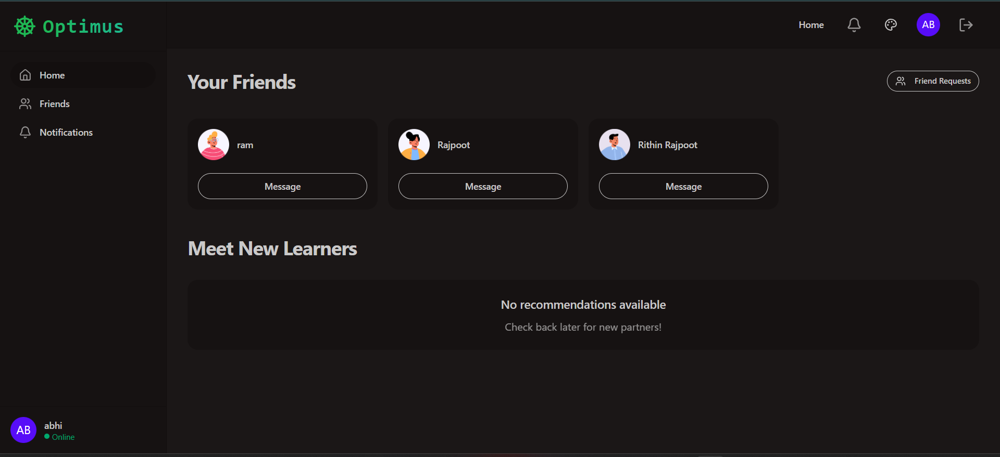

# Optimus Chat Application

<div align="center">
  
  
  <h3>🚀 A modern real-time chat application built with React, Node.js, Express, MongoDB, and Stream Chat.</h3>
  
  <p>
    
    
    
    
    
  </p>
  
  <p>
    <a href="https://github.com/Abhi5hek-20/Optimus-Chat-Application/stargazers">
      
    </a>
    <a href="https://github.com/Abhi5hek-20/Optimus-Chat-Application/network/members">
      
    </a>
    <a href="https://github.com/Abhi5hek-20/Optimus-Chat-Application/issues">
      
    </a>
  </p>
</div>

---

## Features

- 🔐 User authentication (JWT)
- 💬 Real-time messaging with Stream Chat
- 📱 Responsive design with TailwindCSS & DaisyUI
- 👥 Friend system with friend requests
- 🎨 Theme switching (light/dark modes)
- 📞 Video calling integration
- 🔔 Real-time notifications
- 📱 Mobile-friendly interface

## Tech Stack

### Frontend
- React 19
- Vite
- TailwindCSS + DaisyUI
- Stream Chat React SDK
- React Query (TanStack Query)
- React Router
- Zustand (state management)

### Backend
- Node.js + Express
- MongoDB + Mongoose
- JWT Authentication
- Stream Chat SDK
- bcryptjs for password hashing

## Getting Started

### Prerequisites
- Node.js (v18 or later)
- MongoDB
- Stream Chat account

### Installation

1. Clone the repository
```bash
git clone <your-repo-url>
cd chat
```

2. Install backend dependencies
```bash
cd backend
npm install
```

3. Install frontend dependencies
```bash
cd ../frontend
npm install
```

4. Set up environment variables

Backend (.env):
```env
PORT=5000
MONGODB_URI=mongodb://localhost:27017/chat-app
JWT_SECRET=your_jwt_secret_here_make_it_very_long_and_random
NODE_ENV=development
STREAM_API_KEY=your_stream_api_key_here
STREAM_API_SECRET=your_stream_api_secret_here
```

Frontend (.env):
```env
VITE_BACKEND_URL=http://localhost:5000
VITE_STREAM_API_KEY=your_stream_api_key_here
```

5. Start the development servers

Backend:
```bash
cd backend
npm run dev
```

Frontend:
```bash
cd frontend
npm run dev
```

## Deployment

### Frontend (Vercel/Netlify)
```bash
cd frontend
npm run build
```

### Backend (Railway/Render/Heroku)
```bash
cd backend
npm start
```

## Environment Variables

Make sure to set these in your deployment platform:

### Backend
- `PORT`: Server port (default: 5000)
- `MONGODB_URI`: MongoDB connection string
- `JWT_SECRET`: Secret for JWT tokens
- `NODE_ENV`: production
- `STREAM_API_KEY`: Stream Chat API key
- `STREAM_API_SECRET`: Stream Chat API secret

### Frontend
- `VITE_BACKEND_URL`: Backend API URL
- `VITE_STREAM_API_KEY`: Stream Chat API key

## Features Overview

- **Authentication**: Secure login/signup with JWT
- **Real-time Chat**: Powered by Stream Chat SDK
- **Friends System**: Send/accept friend requests
- **Responsive Design**: Works on desktop and mobile
- **Theme Support**: Multiple color themes
- **Video Calls**: Integrated video calling
- **File Sharing**: Upload and share files in chat

## Scripts

### Backend
- `npm run dev`: Start development server with nodemon
- `npm start`: Start production server

### Frontend
- `npm run dev`: Start development server
- `npm run build`: Build for production
- `npm run preview`: Preview production build

## Contributing

1. Fork the repository
2. Create your feature branch (`git checkout -b feature/amazing-feature`)
3. Commit your changes (`git commit -m 'Add some amazing feature'`)
4. Push to the branch (`git push origin feature/amazing-feature`)
5. Open a Pull Request

## License

This project is licensed under the MIT License.
